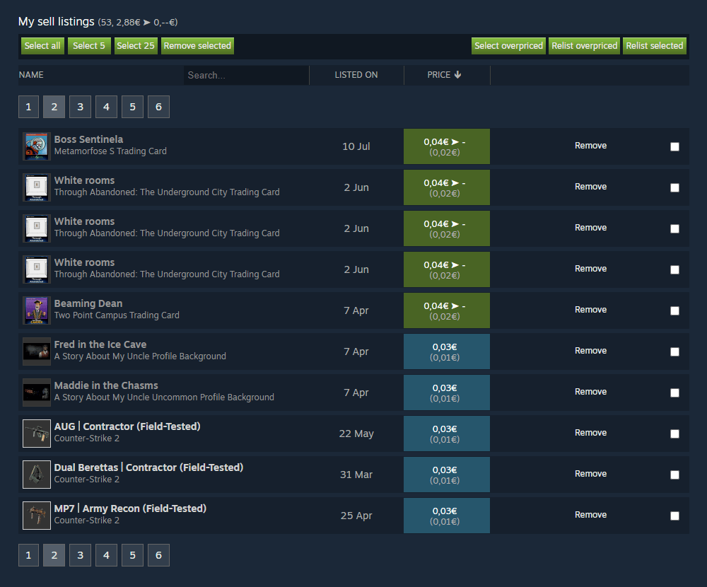
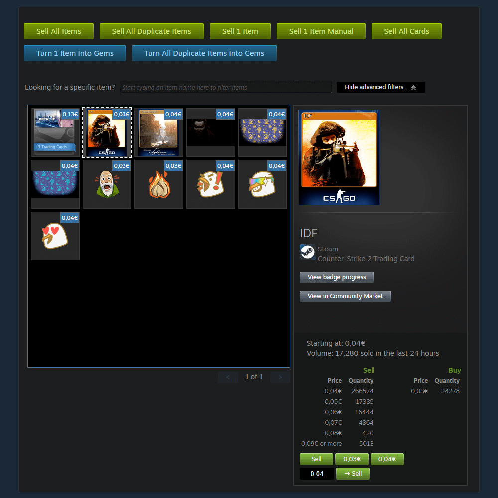
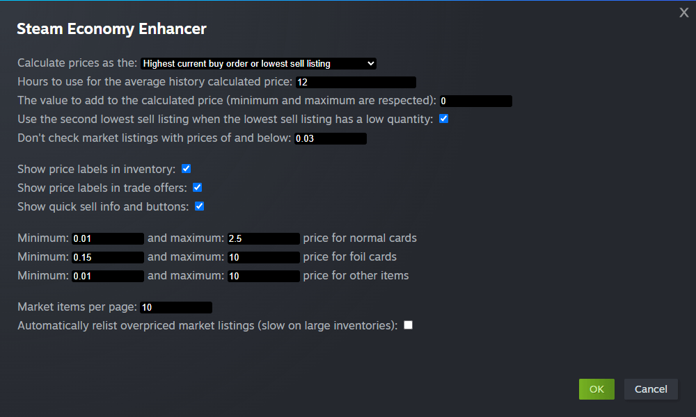
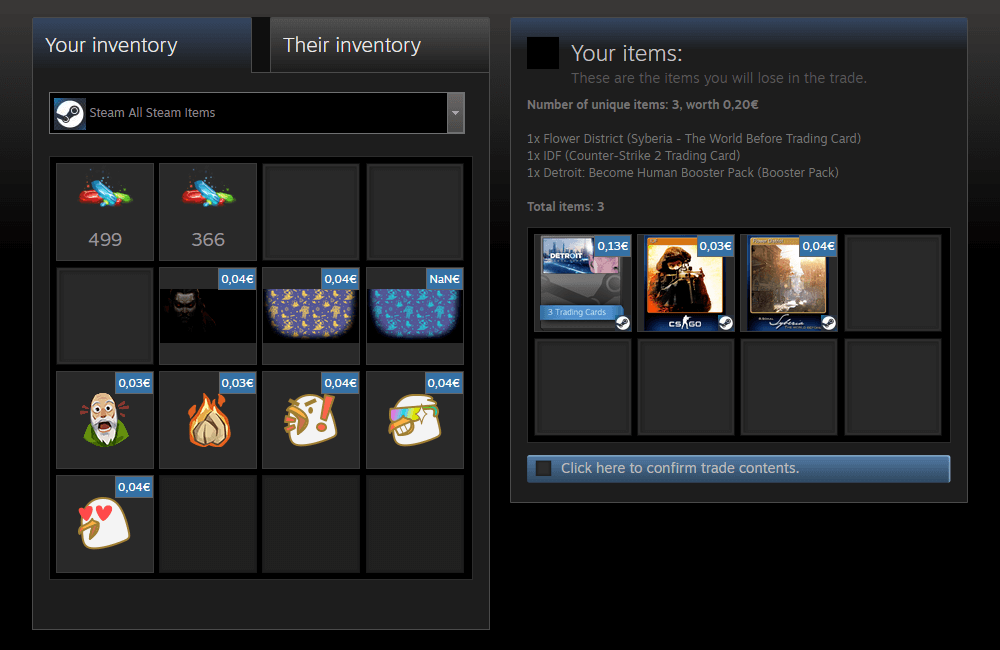

#  Steam Economy Enhancer

A free userscript to enhance your Steam Inventory, Steam Market and Steam Tradeoffers.

It adds the following features to the Steam Market:

*    Detect overpriced and underpriced items.
*    Select 5/25/all (overpriced) items and remove them at once.
*    (Automatically) relist overpriced items.
*    Sort and search items by name, price or date.
*    Total price for listings, as seller and buyer.

It adds the following features to the Steam Inventory:

*    Sell all (selected) items or trading cards automatically.
*    Select multiple items simultaneously with *Shift* or *Ctrl*.
*    Market sell and buy listings added to the item details.
*    Quick sell buttons to sell an item without confirmations.
*    Shows the lowest listed price for each item.
*    Turn selected items into gems.
*    Unpack selected booster packs.

It adds the following features to the Steam Tradeoffers:

*    A summary of all items from both parties that includes total number of items, number of unique items and item count breakdown (how many of each item there are)
*    Select all items of the current page.
*    Shows the lowest listed price for each inventory item.

The pricing can be based on the lowest listed price, the price history and your own minimum and maximum prices.
This can be defined in Steam Economy Enhancer's settings, which you can find at the top of the page near the *Install Steam* button.

> [!NOTE]  
> It is free but there is **NO** support. If you want to add functionality, feel free to submit a PR.

### Download

[Install Steam Economy Enhancer](https://raw.githubusercontent.com/Nuklon/Steam-Economy-Enhancer/master/code.user.js)

*[Violentmonkey](https://violentmonkey.github.io/) is required to install.*

### Screenshots

*Market*

*Inventory*

*Options*

*Trade offers*

### License

[MIT](LICENSE)
